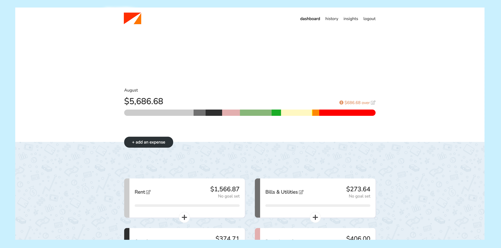
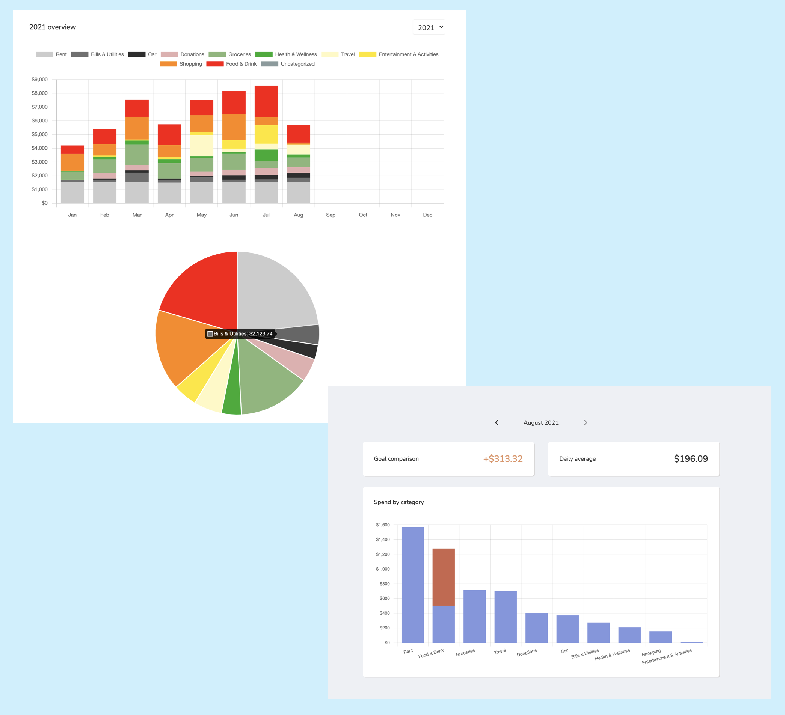
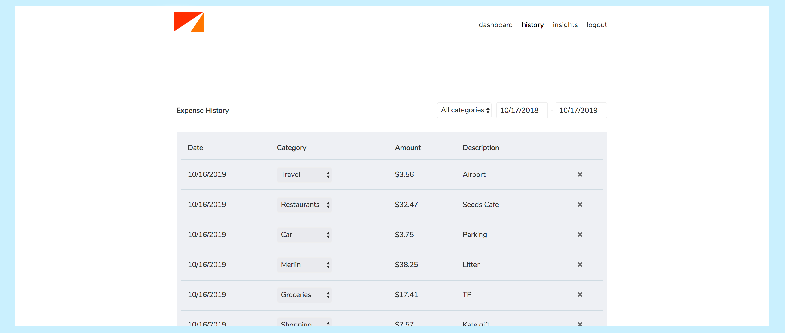
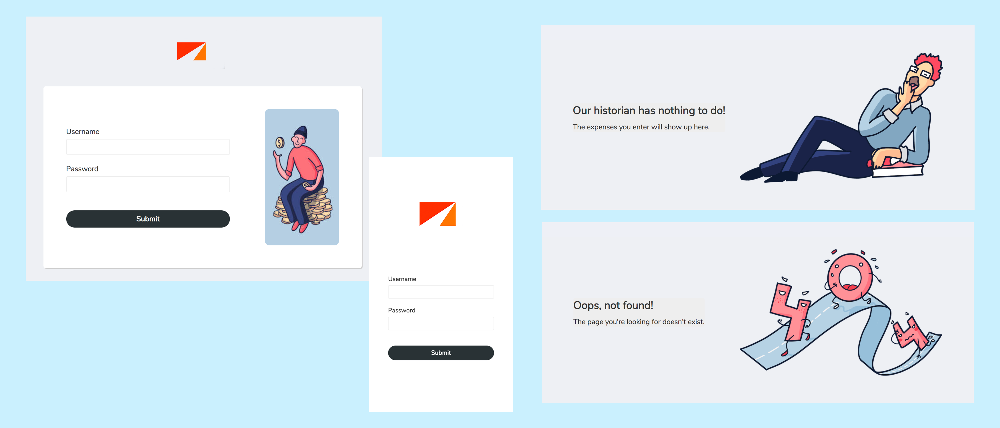

## About

In a nutshell: a private budgeting tool that can be self-hosted.

This project is an attempt to understand and control my own
spending better without giving my banking/financial info
to a 3rd party. The app is meant to be used with 1 login, and
you can host easily your own instance.

## Features

#### Dashboard
The dashboard lets you quickly see how you're doing in the current month.
You can set a spend goal per month and/or per category. This
is also where you quickly add individual expenses.

#### Insights
The insights page lets you review any year or month in more
detail.

#### History
The history page lets you drill down into actual purchases,
as well as do any tweaking (e.g. changing category or deleting).

#### Fun and mobile friendly
OnTrack has a light and fun voice that makes it a
pleasure to use. The entire app is also mobile
friendly.

## Installation
- [Install with Homebrew](docs/homebrew_install.md)
- [Install on Ubuntu 16.04+](docs/ubuntu_install.md)
- Spin up an instance (for free) using the Heroku deploy button below. Heroku account is required.

### Creating a user
- `bundle exec rails c` to run Rails console
- `User.create!(username: "...", password: "...")` The username and password will be hashed.
- If you ever need to change your username/password: `User.first.update!(username: "...", password: "...")`